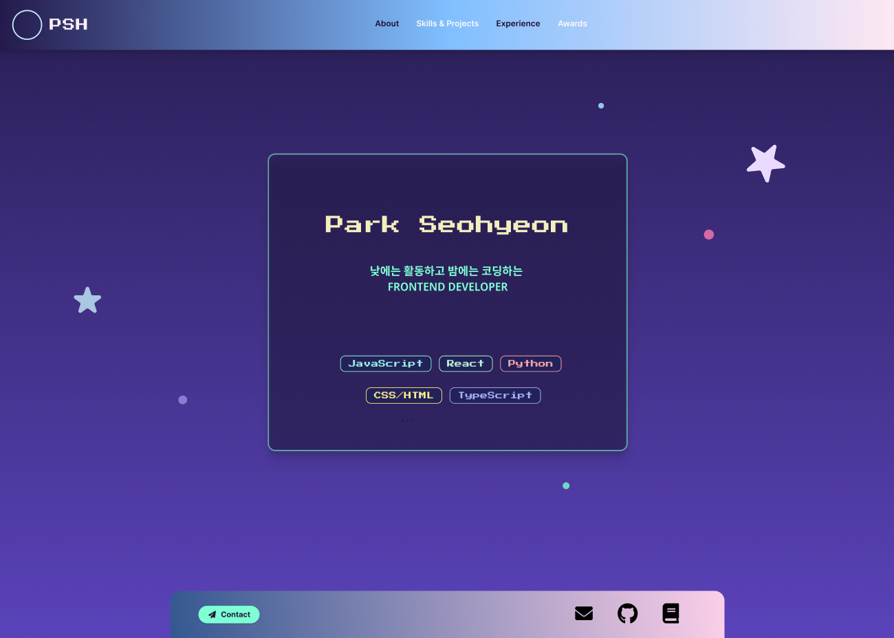
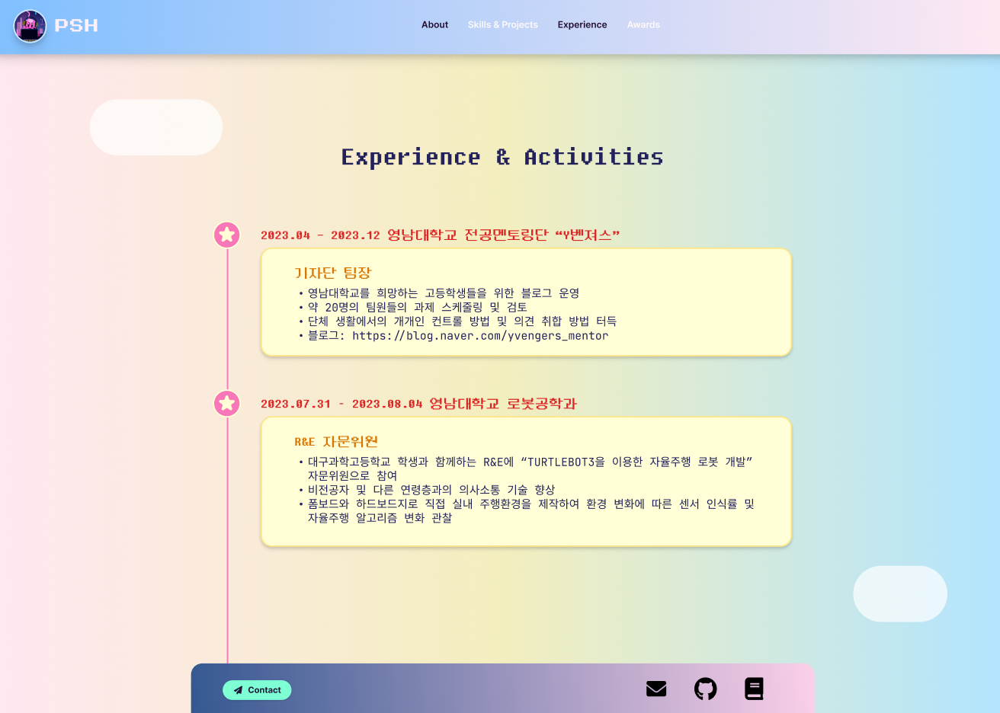

# 간단한 자기소개 페이지 만들기

- **개발자**: 박서현 (psh22112100@gmail.com)
- **개발 기간**: 2025년 5월 23일 4시간
- **설계 방법**: Figma로 디자인 설계 -> main 페이지 구축 -> activity 페이지 구축
- **Figma 디자인**
  - 디자인 컨셉: 낮에는 대외활동하고 밤에는 코딩하는 개발자
  - main 페이지
    
  - activity 페이지
    
- **실행 방법**: src 폴더의 main.html을 실행
- **부족한 점**: acitivity 페이지의 타임라인 선 구현 실패
