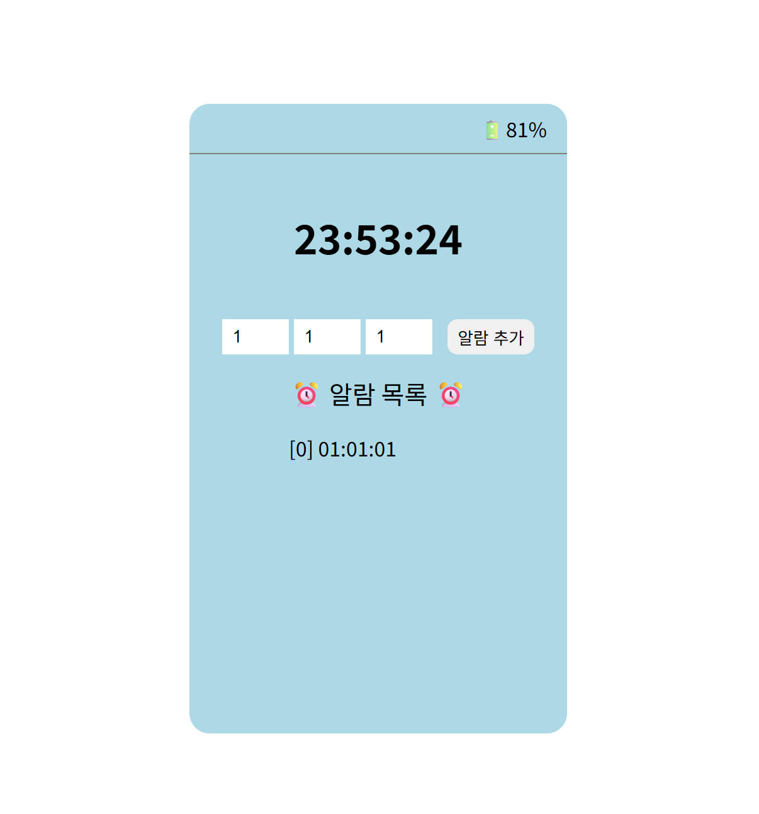

# 📜 업무 요청서

실제 이벤트가 있는 시계 페이지 구현

- **기능 1.** 화면에 배터리가 표시되며, 처음에 동작시키면 100%이고, 1초에 1%씩 감소

- **기능 2.** 배터리가 0%가 되면, 시계화면에서 시간이 표시되지 않고 검은색으로 변함

- **기능 3.** 시/분/초를 설정하고 추가를 누르면 알람이 추가되며 알람 현황에도 업데이트. 단, 최대 3개 알람까지 가능

- **기능 4.** 본인만의 추가기능을 1개 추가
  - 미개발

 

# 🖥️ 개발 사항

- **개발자**: 박서현 (psh22112100@gmail.com)
- **개발 기간**: 2025년 6월 6일(1시간)
- **개발 결과물**:
  
